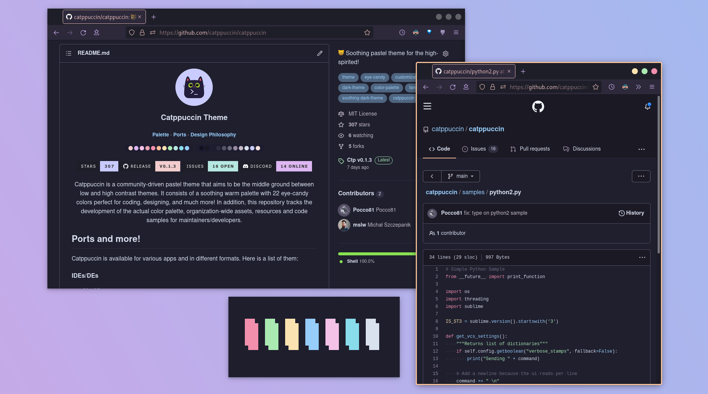

<h3 align="center">
	 
	
	Catppuccin for GitHub
	
</h3>

	
	
	
    

	

## Usage

#### Stylus
1. Install Stylus [Firefox](https://addons.mozilla.org/en-GB/firefox/addon/styl-us/)/[Chrome](https://chrome.google.com/webstore/detail/stylus/clngdbkpkpeebahjckkjfobafhncgmne) extension.
2. Enable CSP Patching from Stylus Settings > Advanced.
3. [Click here to install.](https://github.com/catppuccin/github/raw/main/catppuccin.user.css)

#### Stylish
1. Install Stylish [Firefox](https://addons.mozilla.org/en-GB/firefox/addon/stylish/)/[Chrome](https://chrome.google.com/webstore/detail/stylish-custom-themes-for/fjnbnpbmkenffdnngjfgmeleoegfcffe) extension.
2. Create a new custom Style that applies to `github.com`.
3. Copy content of [catppuccin.css](catppuccin.css) and paste to created Style.

#### Refined Github
1. Install the extension called [Refined GitHub](https://github.com/refined-github/refined-github)
2. Right Click on the extension
3. Go to options/preferences (depends on the browser)
4. Copy content of [catppuccin.css](catppuccin.css) and paste to "Custom CSS" box.

## 💝 Thanks to

- [Pocco81](https://github.com/Pocco81)
- [Andreas Grafen](https://github.com/andreasgrafen)

&nbsp;

Copyright &copy; 2020-present <a href="https://github.com/catppuccin" target="_blank">Catppuccin Org</a>

